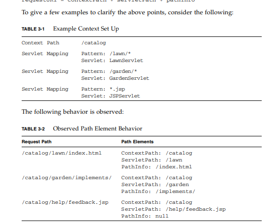

# JavaWeb

## 1、基本概念

web分：

1. 静态web
   - 不会发生变化的数据
2. 动态web
   - 提供的数据会根据条件的不同发生变化，根据有灵活性

### 1.2、web应用程序

- 使web资源能够被外界访问，对外界提供服务


## 2、web服务器

服务器是一种被动的操作，用来处理用户的一些请求和给用户一些响应的信息；

**Tomcat 9.024**

1. 启动Tomcat
   - bin/startup.bat
2. 关闭Tomcat
   - bin/shutdown.bat
3. 配置
   - 核心配置文件 conf/server.xml
   - 可配置端口号、访问域名（修改域名需要修改本机的映射文件Host）
4. 默认网站应用存放位置为 webapps
5. 在IDEA中配置TOMCAT，要手动将项目部署

**可能遇到的问题**

1. Java环境变量没有配会导致启动时闪退
2. 配置了环境变量还闪退，是兼容性问题
3. 启动出现乱码，不要管


## 3、发布一个web网站

- 将自己写的网站放到服务器（Tomcat）中指定的web应用的文件夹（webapps）下，就可以访问了。网站应该有的结构

  ``` java
  --webapps:Tomcat服务器的web目录
      -ROOT
      -kuangstudy：网站的目录名
      	-WEB-INF
      		-web.xml：网站的配置文件
      		-classes：java程序
      		-lib：web应用所依赖的jar包
      	-index.html：默认的首页
      	-static：存放静态文件的目录
      		-css
      			-style.css
      		-js
      		-img
  ```

  

## 4、Http

### 4.1、什么是Http

HTTP（超文本传输协议）是一个简单的请求-响应协议，他通常运行在TCP之上

- 文本：html,字符串
- 超文本：图片、音乐……

### 4.2、两个版本

- http1.0
  - 在一次请求响应操作完成之后，tcp连接会断开，再次请求需要重新建立tcp连接
- http1.1
  - 在一次请求响应操作完成之后可以不断开tcp连接，再次请求不需要重新建立tcp连接
  - 在首部行中有一个首部字段可以判断是否保持连接


## 5、Maven 3.6.2

### 5.1 Maven项目架构管理工具

就是用来方便导入jar包的

**Maven的核心思想**：约定大于配置

- 有约束，不要去违反

Maven会规定你该如何去编写我们的Java代码，必须要按照这个规范来

由于maven的约定大于配置，之后可能会遇到自己写的配置文件无法被导出或者生效的问题，这些问题的解决方案如下：

1. 在build结点中配置resource，来防止资源导出失败的问题

   


### 5.2 下载安装Maven

### 5.3 配置环境变量

- M2_HOME maven目录下的bin目录 （自动配置框架如SpringBoot等引用了M2_HOME）
- MAVEN_HOME maven的目录

### 5.4 修改阿里云镜像

### 5.5 本地仓库

### 5.6 在IDEA中使用Maven

1. 启动IDEA
2. 创建一个MAVEN WEB项目
3. 记得选择配置文件和本地仓库文件夹
4. 使用模板创建成功之后，src/main下没有java和resource文件夹，src下会少一个test文件夹，需要自己创建，然后右键java和resource将他们分别标记为源码目录和资源目录
5. 不使用模板创建之后，java、resource、test都会有

### 5.7 POM文件

pom.xml 是maven的核心配置文件


## 6 Servlet

### 6.1 Servlet简介

​	Servlet是Java Servlet的简称，称为小服务程序，狭义的Servlet是指Java语言实现的一个接口，广义的Servlet是指任何实现了这个Servlet接口的类。

​	一系列实现了Servlet接口的类可以对外提供服务，这些类组成了小服务程序。

> [Servlet说明书](https://jcp.org/aboutJava/communityprocess/final/jsr340/index.html)

### 6.2 HelloServlet

Servlet接口Sun公司有两个默认的实现类：HttpServlet、

1. 构建一个普通的Maven项目，删掉里面的src目录，以后的学习就在这个项目中建立Moudel；这个空的工程就是Maven的主工程；建立Moudel后就会变成Maven父子工程。

2. 关于Maven父子工程的理解：

   - 父项目中会有

     ``` xml
     <modules>
             <module>servlet-01</module>
      </modules>
     ```

   - 子项目中会有

     ``` xml
       <parent>
         <groupId>com.zcr</groupId>
         <artifactId>javaweb-02-servlet</artifactId>
         <version>1.0-SNAPSHOT</version>
       </parent>
     ```

     这里要注意的一点，子项目中的POM文件可能会没有parent结点，此时手动加入即可，具体原因未知。使用maven版本3.6.2，ide为idea

   - 父项目的jar包，子项目可以直接使用

3. Maven环境优化

   1. 修改web.xml为最新的
   2. 将maven的结构搭建完整，src/main/java，src/main/resources

4. 编写一个Servelt程序

   1. 编写一个普通类HelloServlet

   2. 实现Servlet接口，这里继承的是HttpServlet

      ``` java
      public class HelloServlet extends HttpServlet {
          @Override
          protected void doGet(HttpServletRequest req, HttpServletResponse resp) throws ServletException, IOException {
      
              PrintWriter writer = resp.getWriter();
              writer.print("hello,servlet");
          }
      
          @Override
          protected void doPost(HttpServletRequest req, HttpServletResponse resp) throws ServletException, IOException {
      
          }
      }
      ```

5. 注册Servlet并编写Servlet的映射，以便外界能够访问

   ``` xml
     <servlet>//注册
       <servlet-name>HelloServlet</servlet-name>
       <servlet-class>com.zcr.servlet.HelloServlet</servlet-class>
     </servlet>
     <servlet-mapping>//编写映射关系
       <servlet-name>HelloServlet</servlet-name>
       <url-pattern>/hello</url-pattern>
     </servlet-mapping>
   ```

   

6. 配置Tomcat

   注意项目发布的路径

7. 启动！

### 6.3 Servlet原理

Servlet是由Web服务器调用，web服务器在收到浏览器请求之后：

1. 浏览器发起请求，请求由web服务器接收
2. web服务器根据请求的URL，查询映射，找到对应的Servlet实现类，将其加载并实例化，将request对象与response对象传递给Servlet实现类的对象
3. 在Servlet实现类的对象中根据request的具体方法来确定调用doGet、doPost等方法
4. 最后使用response对象给出响应结果

### 6.4 Servlet映射（Mapping）

将具体的URL映射到具体的Servlet实现类，实现对外服务

1. 一个映射路径只能对应一个Serlvet实现类

2. 一个Servlet实现类可以对应多个映射路径

3. 映射路径中可以使用通配符

4. 若要修改web服务器启动之后的主页，可以使用默认请求路径

   ``` xml
     <servlet-mapping>
       <servlet-name>HelloServlet</servlet-name>
       <url-pattern>/*</url-pattern>
     </servlet-mapping>
   
   优先级问题：/*的优先级低，当有对应的URL有指定的Serlvet实现类，则就会去找对应的Servlet实现类，只有当没有指定时，才会找默认的/*所对应的Servlet实现类
   ```

5. 可以映射自定义后缀，此时“*”前面不能使用“/”

   ``` xml
     <servlet-mapping>
       <servlet-name>HelloServlet</servlet-name>
       <url-pattern>*.任意后缀</url-pattern>
     </servlet-mapping>
   ```

#### 6.4.1 关于URL Pattern

requestURI = context path+servlet path+path info



总结：

- context path 就是项目名称
- 配置在web.xml中url-pattern结点中的url都是servlet path
  - 注意，后缀匹配的path info是null
  - 注意，默认Servlet的path info 也是null
- 在servlet path之后的内容都是path info

URL匹配的规则如下：

1. 完整路径匹配
2. 根据路径前缀，进行最长匹配
3. 使用请求路径中的后缀进行匹配，如".jsp"
4. **如果以上都没有匹配到合适的Servlet，将使用默认Servlet来处理请求**

##### 6.4.1.1 如何配置URL Pattern

1. 使用“ / ”开头，使用“ /\* ”结尾，表示使用路径匹配，比如/foo/bar/\*
2. 使用” *.xxx “表示使用后缀匹配
3. 只使用“ /* ”，表示匹配所有的请求
4. 只使用“ / ”，表示所对应的Servlet是一个**默认的Servlet**


##### 6.4.1.2 关于SpringMVC的DispatcherServlet的URL Mapping

其URL-Pattern只能配置" / "，让其变成默认Servlet（默认Servlet的优先级最低）

虽然需要DispatcherServlet处理大部分请求，但是如果配置成”/*“（表示匹配所有请求），就会匹配到所有请求，包括后缀为".jsp"的请求。

当匹配到".jsp"的请求后，由于Controller中还会调用".jsp"请求，此请求还会进入到DispatcherServlet会找不到与".jsp"请求相对应的Handler（也就是Controller）就会爆出404错误


### 6.5 ServletContext

web服务器启动的时候，它会为每个web应用都创建一个对应的ServletContext对象，它代表了当前的web应用；

-  Servlet实现类之间共享数据

  我在这个Servlet实现类中保存的数据，可以在另一个Servlet实现类中拿到

- 获取初始化参数

  ``` xml
  <!--  配置一些web应用的初始化参数-->
    <context-param>
      <param-name>url</param-name>
      <param-value>jdbc:mysql://localhost:3306/mybatis</param-value>
    </context-param>
  ```

  ``` java
  ServletContext servletContext = this.getServletContext();
  String url = servletContext.getInitParameter("url");
  resp.getWriter().print(url);
  ```

- 请求转发Dispatcher(不会改变浏览器上的URL，区别于重定向，重定向会改变浏览器上的URL，类似DNS递归查询和迭代查询)

  ``` java
  RequestDispatcher requestDispatcher = servletContext.getRequestDispatcher("/getParam");
  requestDispatcher.forward(req,resp);
  
  通过将想要转发的目标/getParam（web.xml中配置的路径）当作参数传入，由RequesDispatcher对象来进行转发
  ```

- 读取资源文件

  Properties

  - 在java目录下新建properties
  - 在resources目录下新建properties

  都被打包到了同一路径下：classes，这个路径称为类路径

  ``` java
  ServletContext servletContext = this.getServletContext();
          InputStream resourceAsStream = servletContext.getResourceAsStream("/WEB-INF/classes/db.properties");
  Properties properties = new Properties();
  properties.load(resourceAsStream);
  String username = properties.getProperty("username");
  String password = properties.getProperty("password");
  ```

  

## 7 Cookie

保存在用户本地的数据，用户在访问页面时，浏览器会自动的发送对应的Cookie数据

## 8 Session

保存在服务器中的数据，一个用户一个，Session有个SessionID，SessionID存于Cookie中，用户在首次访问页面时，服务器创建一个Session对象，并在用户的Cookie中存入对应的SessionID。用户再一次访问时，可以根据Cookie中的SessionID获得对应的Session，Session中可以存放对象

## 9 JSP

本质上就是一个Servlet对象，把他当作一个java类来写就好了

JSP中九大内置对象：

1. ServletContext：Application
2. PageContext：pageContext
3. request
4. response
5. out（输出流）
6. Page：page，JSP自身
7. ServletConfig：config
8. Session
9. exception（只有在错误页面能用）


## 10 MVC

Model，View，Controller

 模型（类），视图（页面），控制器（Servlet或Spring中的Controller）

**控制器**使用**模型**去渲染**视图**


### 10.1 架构分层

视图层

控制器层

业务层

数据访问层（访问数据库）


## 11 过滤器 Filter

实现接口Filter，doFilter中需要调用FilterChain，否则无法将请求和响应对象传给Servlet实现类

在web.xml配置文件中配置filter节点

