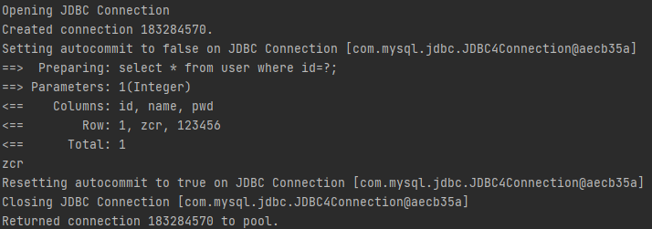
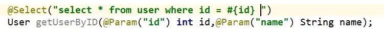

[toc]


# 1 Mybatis（ORM，对象关系映射框架）

环境：

- JDK1.8
- Mysql 5.7.19
- Maven 3.6.2


## 1 .1如何获取Mybatis

- maven仓库

``` xml
<dependency>
  <groupId>org.mybatis</groupId>
  <artifactId>mybatis</artifactId>
  <version>x.x.x</version>
</dependency>
```

## 1.2 持久化

数据持久化

## 1.3 持久层

负责数据持久化工作的代码


# 2 第一个Mybatis程序

``` xml
        <dependency>
            <groupId>junit</groupId>
            <artifactId>junit</artifactId>
            <version>4.12</version>
            <scope>test</scope>
        </dependency>
        <dependency>
            <groupId>mysql</groupId>
            <artifactId>mysql-connector-java</artifactId>
            <version>5.1.47</version>
        </dependency>
        <dependency>
            <groupId>org.mybatis</groupId>
            <artifactId>mybatis</artifactId>
            <version>3.5.6</version>
        </dependency>
```

## 2.1 编写Mybatis的配置文件

``` xml
<?xml version="1.0" encoding="UTF-8" ?>
<!DOCTYPE configuration
  PUBLIC "-//mybatis.org//DTD Config 3.0//EN"
  "http://mybatis.org/dtd/mybatis-3-config.dtd">
<configuration>
  <environments default="development">
    <environment id="development">
      <transactionManager type="JDBC"/>
      <dataSource type="POOLED">
        <property name="driver" value="${driver}"/>
        <property name="url" value="${url}"/>
        <property name="username" value="${username}"/>
        <property name="password" value="${password}"/>
      </dataSource>
    </environment>
  </environments>
  <mappers>
    <mapper resource="org/mybatis/example/BlogMapper.xml"/>
  </mappers>
</configuration>
```

## 2.1 编写Mybatis工具类获取sqlsession

``` java
import org.apache.ibatis.io.Resources;
import org.apache.ibatis.session.SqlSession;
import org.apache.ibatis.session.SqlSessionFactory;
import org.apache.ibatis.session.SqlSessionFactoryBuilder;

import java.io.IOException;
import java.io.InputStream;

//用于获得sqlsessionFactory
public class MybatisUtil {
    private static SqlSessionFactory sqlSessionFactory;
    static{
        String resource = "mybatis-config.xml";
        try {
            InputStream inputStream = Resources.getResourceAsStream(resource);
            sqlSessionFactory = new SqlSessionFactoryBuilder().build(inputStream);
        } catch (IOException e) {
            e.printStackTrace();
        }
    }

    public static SqlSession getSqlSession(){
        return sqlSessionFactory.openSession();
    }
}
```


## 2.3 编写代码

- 实体类 User

- DAO接口 UserDAO

  ``` java
  public interface UserDAO {
      List<User> getUserList();
  
      User getUserById(int id);
  
      int addUser(User user);
  
      int updateUser(User user);
  
      int deleteUser(int id);
  }
  ```

  

- 接口实现类 由UserMapper.xml实现

  ``` xml
  <?xml version="1.0" encoding="UTF-8" ?>
  <!DOCTYPE mapper
          PUBLIC "-//mybatis.org//DTD Mapper 3.0//EN"
          "http://mybatis.org/dtd/mybatis-3-mapper.dtd">
  <!--namespace绑定一个DAO或者mapper-->
  <mapper namespace="com.zcr.dao.UserDAO">
  <!--    虽然返回类型是一个List，但是这边只要写List中的类型即可,id是接口中的方法名 要一一对应-->
      <select id="getUserList" resultType="com.zcr.pojo.User">
          select * from mybatis.user;
      </select>
  
      <select id="getUserById" parameterType="int" resultType="com.zcr.pojo.User">
          select * from user where id=#{id};
      </select>
      
  <!--插入删除更新等修改数据的操作一定要commit才会生效-->
      <insert id="addUser" parameterType="com.zcr.pojo.User">
          insert into mybatis.user(id,name,pwd) values(#{id},#{name},#{pwd});
      </insert>
  
      <update id="updateUser" parameterType="com.zcr.pojo.User">
          update mybatis.user set name=#{name},pwd=#{pwd} where id=#{id};
      </update>
  
      <delete id="deleteUser" parameterType="int">
          delete from mybatis.user where id=#{id};
      </delete>
  </mapper>
  ```

  


## 2.4 Junit测试

注意点：

1. 每一个Mapper.xml都需要再配置的xml中注册

   ``` xml
       <mappers>
           <mapper resource="UserMapper.xml"/>
       </mappers>
   ```

2. resource中的文件如果不在resources文件夹下且是maven项目，需要在maven中配置编译的相关设置，不然不在resources的文件是会被忽略的

3. 如果出现了MapperRegistry错误，就是mapper.xml没有注册，看点1


## 2.5 总结

Mybatis工作路径：

1. 编写mybatis-config.xml配置文件

2. 编写XXXMapper接口

3. 编写XXXMapper.xml配置文件，其中的namespace要指向XXXMapper接口

4. 将XXXMapper.xml配置文件在mybatis-config.xml配置文件中注册

5. 使用：

   - 通过SqlSessionFactoryBuilder创建SqlSessionFactory对象

     - SqlSessionFactoryBuilder需要mybatis-config.xml配置文件作为参数

   - 再通过SqlSessionFactory对象创建SqlSession对象

   - 关于SqlSession对象

     - 此对象可以通过给定的Mapper接口的类对象创建接口的实现类，通过调用实现类来操作数据库

       ``` java
       UserDAO mapper = sqlSession.getMapper(UserDAO.class);
       ```

     - 还可以通过传递Mapper接口的全限定名来直接执行数据库操作

       ``` java
       List<User> users = sqlSession.selectList("com.zcr.dao.UserDAO.getUserList");
       ```

6. 关于各个对象的Scope

   - SqlSessionFactoryBuilder对象用完就可以销毁，Scope定在方法中
   - SqlSessionFactory对象Scope为Singleton，为每一个请求创建SqlSession对象
   - SqlSession对象Scope为方法，为每一个请求创建一个SqlSession对象


# 3 Map和模糊查询

## 3.1 使用Map代替实体类

- Mapper接口

  ``` java
  public interface UserDAO {
      List<User> getUserList();
  
      User getUserById(int id);
  
      int addUser(User user);
  
      int updateUser(User user);
  
      int deleteUser(int id);
      
      User getUserById_map(Map<String,Object> map);
      int addUser_map(Map<String,Object> map);
  }
  ```

- Mapper接口对应的xml

  ``` xml
  <!--    use map-->
      <insert id="addUser_map" parameterType="map">
          insert into mybatis.user(id,name,pwd) values(#{userId},#{userName},#{userPwd});
      </insert>
  <!--这里#{userID}的userID是Map中对应的键值-->
  ```

- 测试类

  ``` java
     @Test
      public void adduser_map(){
          UserDAO mapper = sqlSession.getMapper(UserDAO.class);
          HashMap<String, Object> map = new HashMap<>();
          map.put("userId",5);
          map.put("userName","zcr");
          map.put("userPwd","123456");
          int res = mapper.addUser_map(map);
          if(res!=0){
              System.out.println("插入成功");
              sqlSession.commit();
          }
          sqlSession.close();
      }
  ```

## 3.2 模糊查询

like关键字


# 4 XML配置

## 4.1 核心配置文件

- mybatis-config.xml
  - configuration（配置）
  - properties（属性）
  - settings（设置）
  - typeAliases（类型别名）
  - typeHandlers（类型处理器）
  - objectFactory（对象工厂）
  - plugins（插件）
  - environments（环境配置）
    - environment（环境变量）
      - transactionManager（事务管理器）
      - dataSource（数据源）
  - databaseIdProvider（数据库厂商标识）
  - mappers（映射器）

## 4.2 环境配置（environments）

Mybatis 可以配置多种环境，但每个SqlSessionFactory实例只能选择一种环境

Mybatis默认的事务管理器是JDBC，默认使用连接池

## 4.3 属性（Properties）

> 这些属性可以在外部进行配置，并可以进行动态替换。你既可以在典型的 Java 属性文件中配置这些属性，也可以在 properties 元素的子元素中设置。例如：
>
> ```xml
> <properties resource="org/mybatis/example/config.properties">
>   <property name="username" value="dev_user"/>
>   <property name="password" value="F2Fa3!33TYyg"/>
> </properties>
> ```
>
> 设置好的属性可以在整个配置文件中用来替换需要动态配置的属性值。比如:
>
> ```xml
> <dataSource type="POOLED">
>   <property name="driver" value="${driver}"/>
>   <property name="url" value="${url}"/>
>   <property name="username" value="${username}"/>
>   <property name="password" value="${password}"/>
> </dataSource>
> ```
>
> 这个例子中的 username 和 password 将会由 properties 元素中设置的相应值来替换。 driver 和 url 属性将会由 config.properties 文件中对应的值来替换。这样就为配置提供了诸多灵活选择。

运用：

1. 编写一个db.properties文件

   ``` properties
   driver=com.mysql.jdbc.Driver
   url=jdbc:mysql://localhost:3306/mybatis?useSSL=true&amp;useUnicode=true&characterEncoding=utf-8
   username=root
   password=admin
   ```

2. 在mybatis-config.xml 文件中引入这个properties文件

   ``` xml
   <configuration>
       <properties resource="db.properties"/>
       ……
   </configuration>
   ```

> 如果一个属性在不只一个地方进行了配置，那么，MyBatis 将按照下面的顺序来加载：
>
> - 首先读取在 properties 元素体内指定的属性。
> - 然后根据 properties 元素中的 resource 属性读取类路径下属性文件，或根据 url 属性指定的路径读取属性文件，并覆盖之前读取过的同名属性。
> - 最后读取作为方法参数传递的属性，并覆盖之前读取过的同名属性。
>
> 因此，通过方法参数传递的属性具有最高优先级，resource/url 属性中指定的配置文件次之，最低优先级的则是 properties 元素中指定的属性。


## 4.4 别名

> 类型别名可为 Java 类型设置一个缩写名字。 它仅用于 XML 配置，意在降低冗余的全限定类名书写。例如：
>
> ```xml
> <typeAliases>
>   <typeAlias alias="Author" type="domain.blog.Author"/>
>   <typeAlias alias="Blog" type="domain.blog.Blog"/>
>   <typeAlias alias="Comment" type="domain.blog.Comment"/>
>   <typeAlias alias="Post" type="domain.blog.Post"/>
>   <typeAlias alias="Section" type="domain.blog.Section"/>
>   <typeAlias alias="Tag" type="domain.blog.Tag"/>
> </typeAliases>
> ```
>
> 当这样配置时，`Blog` 可以用在任何使用 `domain.blog.Blog` 的地方。
>
> 也可以指定一个包名，MyBatis 会在包名下面搜索需要的 Java Bean，比如：
>
> ```xml
> <typeAliases>
>   <package name="domain.blog"/>
> </typeAliases>
> ```
>
> 每一个在包 `domain.blog` 中的 Java Bean，在**没有注解的情况下，会使用 Bean 的首字母小写的非限定类名来作为它的别名**。 比如 `domain.blog.Author` 的别名为 `author`；若有注解，则别名为其注解值。见下面的例子：
>
> ```java
> @Alias("author")
> public class Author {
>     ...
> }
> ```

## 4.5 设置（仅列出比较重要的）

| 设置名                   | 描述                                                         | 有效值                                                       | 默认值 |
| :----------------------- | :----------------------------------------------------------- | :----------------------------------------------------------- | :----: |
| cacheEnabled             | 全局性地开启或关闭所有映射器配置文件中已配置的任何缓存。     | true \| false                                                |  true  |
| lazyLoadingEnabled       | 延迟加载的全局开关。当开启时，所有关联对象都会延迟加载。 特定关联关系中可通过设置 `fetchType` 属性来覆盖该项的开关状态。 | true \| false                                                | false  |
| mapUnderscoreToCamelCase | 是否开启驼峰命名自动映射，即从经典数据库列名 A_COLUMN 映射到经典 Java 属性名 aColumn。 | true \| false                                                | False  |
| logImpl                  | 指定 MyBatis 所用日志的具体实现，未指定时将自动查找。        | SLF4J \| LOG4J \| LOG4J2 \| JDK_LOGGING \| COMMONS_LOGGING \| STDOUT_LOGGING \| NO_LOGGING | 未设置 |

一个配置完整的 settings 元素的示例如下：

```xml
<settings>
  <setting name="cacheEnabled" value="true"/>
  <setting name="lazyLoadingEnabled" value="true"/>
  <setting name="multipleResultSetsEnabled" value="true"/>
  <setting name="useColumnLabel" value="true"/>
  <setting name="useGeneratedKeys" value="false"/>
  <setting name="autoMappingBehavior" value="PARTIAL"/>
  <setting name="autoMappingUnknownColumnBehavior" value="WARNING"/>
  <setting name="defaultExecutorType" value="SIMPLE"/>
  <setting name="defaultStatementTimeout" value="25"/>
  <setting name="defaultFetchSize" value="100"/>
  <setting name="safeRowBoundsEnabled" value="false"/>
  <setting name="mapUnderscoreToCamelCase" value="false"/>
  <setting name="localCacheScope" value="SESSION"/>
  <setting name="jdbcTypeForNull" value="OTHER"/>
  <setting name="lazyLoadTriggerMethods" value="equals,clone,hashCode,toString"/>
</settings>
```

## 4.6 其他配置

- typeHandlers（类型处理器）

  > MyBatis 在设置预处理语句（PreparedStatement）中的参数或从结果集中取出一个值时， 都会用类型处理器将获取到的值以合适的方式转换成 Java 类型。下表描述了一些默认的类型处理器。
  >
  > **提示** 从 3.4.5 开始，MyBatis 默认支持 JSR-310（日期和时间 API） 

- objectFactory（对象工厂）

  > 每次 MyBatis 创建结果对象的新实例时，它都会使用一个对象工厂（ObjectFactory）实例来完成实例化工作。 默认的对象工厂需要做的仅仅是实例化目标类，要么通过默认无参构造方法，要么通过存在的参数映射来调用带有参数的构造方法。 如果想覆盖对象工厂的默认行为，可以通过创建自己的对象工厂来实现。

- plugins（插件）


## 4.7 映射器

> 既然 MyBatis 的行为已经由上述元素配置完了，我们现在就要来定义 SQL 映射语句了。 但首先，我们需要告诉 MyBatis 到哪里去找到这些语句。 在自动查找资源方面，Java 并没有提供一个很好的解决方案，所以最好的办法是直接告诉 MyBatis 到哪里去找映射文件。 你可以使用相对于类路径的资源引用，或完全限定资源定位符（包括 `file:///` 形式的 URL），或类名和包名等。例如：
>
> ```xml
> <!-- 使用相对于类路径的资源引用 -->
> <mappers>
>   <mapper resource="org/mybatis/builder/AuthorMapper.xml"/>
>   <mapper resource="org/mybatis/builder/BlogMapper.xml"/>
>   <mapper resource="org/mybatis/builder/PostMapper.xml"/>
> </mappers>
> <!-- 使用完全限定资源定位符（URL） -->
> <mappers>
>   <mapper url="file:///var/mappers/AuthorMapper.xml"/>
>   <mapper url="file:///var/mappers/BlogMapper.xml"/>
>   <mapper url="file:///var/mappers/PostMapper.xml"/>
> </mappers>
> <!-- 使用映射器接口实现类的完全限定类名 -->
> <mappers>
>   <mapper class="org.mybatis.builder.AuthorMapper"/>
>   <mapper class="org.mybatis.builder.BlogMapper"/>
>   <mapper class="org.mybatis.builder.PostMapper"/>
> </mappers>
> <!-- 将包内的映射器接口实现全部注册为映射器 -->
> <mappers>
>   <package name="org.mybatis.builder"/>
> </mappers>
> ```
>
> 这些配置会告诉 MyBatis 去哪里找映射文件，剩下的细节就应该是每个 SQL 映射文件了，也就是接下来我们要讨论的。

注意：使用class和package的方式

- 接口和它的Mapper配置文件必须要同名
- 接口和它的mapper配置文件必须在同一个包下


注意：Mybatis不支持在mapper中使用通配符

Mybatis-Spring可以在mapper中使用通配符


# 5 生命周期和作用域

> 理解我们之前讨论过的不同作用域和生命周期类别是至关重要的，因为错误的使用会导致非常严重的并发问题。

**提示** **对象生命周期和依赖注入框架**

依赖注入框架可以创建线程安全的、基于事务的 SqlSession 和映射器，并将它们直接注入到你的 bean 中，因此可以直接忽略它们的生命周期。 如果对如何通过依赖注入框架使用 MyBatis 感兴趣，可以研究一下 MyBatis-Spring 或 MyBatis-Guice 两个子项目。


#### SqlSessionFactoryBuilder

**这个类可以被实例化、使用和丢弃，一旦创建了 SqlSessionFactory，就不再需要它了**。 因此 SqlSessionFactoryBuilder 实例的最佳作用域是方法作用域（也就是局部方法变量）。 你可以重用 SqlSessionFactoryBuilder 来创建多个 SqlSessionFactory 实例，但最好还是不要一直保留着它，以保证所有的 XML 解析资源可以被释放给更重要的事情。

#### SqlSessionFactory

SqlSessionFactory 一旦被创建就应该在应用的**运行期间一直存在，没有任何理由丢弃它或重新创建另一个实例**。 使用 SqlSessionFactory 的最佳实践是在应用运行期间不要重复创建多次，多次重建 SqlSessionFactory 被视为一种代码“坏习惯”。因此 SqlSessionFactory 的最佳作用域是应用作用域。 有很多方法可以做到，最简单的就是使用单例模式或者静态单例模式。

#### SqlSession

**每个线程都应该有它自己的 SqlSession 实例**。SqlSession 的实例不是线程安全的，因此是**不能被共享**的，所以它的最佳的作用域是请求或方法作用域。 绝对不能将 SqlSession 实例的引用放在一个类的静态域，甚至一个类的实例变量也不行。 也绝不能将 SqlSession 实例的引用放在任何类型的托管作用域中，比如 Servlet 框架中的 HttpSession。 如果你现在正在使用一种 Web 框架，考虑将 SqlSession 放在一个和 HTTP 请求相似的作用域中。 换句话说，每次收到 HTTP 请求，就可以打开一个 SqlSession，返回一个响应后，就关闭它。 这个关闭操作很重要，为了确保每次都能执行关闭操作，你应该把这个关闭操作放到 finally 块中。 下面的示例就是一个确保 SqlSession 关闭的标准模式：

```
try (SqlSession session = sqlSessionFactory.openSession()) {
  // 你的应用逻辑代码
}
```

在所有代码中都遵循这种使用模式，可以保证所有数据库资源都能被正确地关闭。


# 6 XML 映射文件

## 6.1 ResultMap

```xml
<resultMap id="UserMap" type="com.zcr.pojo.User">
    <!--column是数据库中的字段名 property是实体类中的属性名，将两者绑定形成映射关系-->
    <result column="pwd" property="password"/>
</resultMap>

<mapper namespace="com.zcr.dao.UserDAO">
<!--    虽然返回类型是一个List，但是这边只要写List中的类型即可,id是接口中的方法名 要一一对应-->
    <select id="getUserList" resultType="UserMap">
        select * from mybatis.user;
    </select>
</mapper>
```

## 6.2 SQL代码片段

这个元素可以用来定义可重用的 SQL 代码片段，以便在其它语句中使用。 参数可以静态地（在加载的时候）确定下来，并且可以在不同的 include 元素中定义不同的参数值。比如：

```xml
<sql id="userColumns"> ${alias}.id,${alias}.username,${alias}.password </sql>
```

这个 SQL 片段可以在其它语句中使用，例如：

```xml
<select id="selectUsers" resultType="map">
  select
    <include refid="userColumns"><property name="alias" value="t1"/></include>,
    <include refid="userColumns"><property name="alias" value="t2"/></include>
  from some_table t1
    cross join some_table t2
</select>
```

也可以在 include 元素的 refid 属性或内部语句中使用属性值，例如：

```xml
<sql id="sometable">
  ${prefix}Table
</sql>

<sql id="someinclude">
  from
    <include refid="${include_target}"/>
</sql>

<select id="select" resultType="map">
  select
    field1, field2, field3
  <include refid="someinclude">
    <property name="prefix" value="Some"/>
    <property name="include_target" value="sometable"/>
  </include>
</select>
```

## 6.3 参数

参数是 MyBatis 非常强大的元素。对于大多数简单的使用场景，你都不需要使用复杂的参数，比如：

```xml
<select id="selectUsers" resultType="User">
  select id, username, password
  from users
  where id = #{id}
</select>
```

上面的这个示例说明了一个非常简单的命名参数映射。鉴于参数类型（parameterType）会被自动设置为 `int`，这个参数可以随意命名。原始类型或简单数据类型（比如 `Integer` 和 `String`）因为没有其它属性，会用它们的值来作为参数。 然而，如果传入一个复杂的对象，行为就会有点不一样了。比如：

```xml
<insert id="insertUser" parameterType="User">
  insert into users (id, username, password)
  values (#{id}, #{username}, #{password})
</insert>
```

如果 User 类型的参数对象传递到了语句中，会查找 id、username 和 password 属性，然后将它们的值传入预处理语句的参数中

### 6.3.1 字符串替换

**总结：#{}会被占位符"？"替代；${}会被直接用指定的字符串替换，并不会有其他处理，会有潜在的SQL注入风险**

默认情况下，使用 `#{}` 参数语法时，MyBatis 会创建 `PreparedStatement` 参数占位符，并通过占位符安全地设置参数（就像使用 ? 一样）。 这样做更安全，更迅速，通常也是首选做法，不过有时你就是想直接在 SQL 语句中直接插入一个不转义的字符串。 比如 ORDER BY 子句，这时候你可以：

```
ORDER BY ${columnName}
```

这样，MyBatis 就不会修改或转义该字符串了。

当 SQL 语句中的元数据（如表名或列名）是动态生成的时候，字符串替换将会非常有用。 举个例子，如果你想 `select` 一个表任意一列的数据时，不需要这样写：

```java
@Select("select * from user where id = #{id}")
User findById(@Param("id") long id);

@Select("select * from user where name = #{name}")
User findByName(@Param("name") String name);

@Select("select * from user where email = #{email}")
User findByEmail(@Param("email") String email);

// 其它的 "findByXxx" 方法
```

而是可以只写这样一个方法：

```java
@Select("select * from user where ${column} = #{value}")
User findByColumn(@Param("column") String column, @Param("value") String value);
```

其中 `${column}` 会被直接替换，而 `#{value}` 会使用 `?` 预处理。 这样，就能完成同样的任务：

```java
User userOfId1 = userMapper.findByColumn("id", 1L);
User userOfNameKid = userMapper.findByColumn("name", "kid");
User userOfEmail = userMapper.findByColumn("email", "noone@nowhere.com");
```

这种方式也同样适用于替换表名的情况。

**提示** 用这种方式接受用户的输入，并用作语句参数是不安全的，会导致潜在的 SQL 注入攻击。因此，要么不允许用户输入这些字段，要么自行转义并检验这些参数。

# 7 日志

## 7.1 日志工厂

如果数据库操作出现异常需要排错，就需要用到日志

| 设置名  | 描述                                                  | 有效值                                                       | 默认值 |
| ------- | ----------------------------------------------------- | ------------------------------------------------------------ | ------ |
| logImpl | 指定 MyBatis 所用日志的具体实现，未指定时将自动查找。 | SLF4J \| LOG4J \| LOG4J2 \| JDK_LOGGING \| COMMONS_LOGGING \| STDOUT_LOGGING \| NO_LOGGING | 未设置 |

重点掌握LOG4J和STDOUT_LOGGING

在Mybatis中具体使用哪一个日志实现，需要在设置中设定

## 7.2 STDOUT_LOGGING 标准日志输出




## 7.3 LOG4J

> 通过使用Log4j，我们可以控制日志信息输送的目的地是[控制台](https://baike.baidu.com/item/控制台/2438626)、文件、[GUI](https://baike.baidu.com/item/GUI)组件，甚至是套接口服务器、[NT](https://baike.baidu.com/item/NT/3443842)的事件记录器、[UNIX](https://baike.baidu.com/item/UNIX) [Syslog](https://baike.baidu.com/item/Syslog)[守护进程](https://baike.baidu.com/item/守护进程/966835)等；我们也可以控制每一条日志的输出格式；通过定义每一条日志信息的级别，我们能够更加细致地控制日志的生成过程。最令人感兴趣的就是，这些可以通过一个[配置文件](https://baike.baidu.com/item/配置文件/286550)来灵活地进行配置，而不需要修改应用的代码。

1.添加依赖

``` xml
 <dependency>
            <groupId>log4j</groupId>
            <artifactId>log4j</artifactId>
            <version>1.2.16</version>
  </dependency>
```

2.编写log4j.properties文件

``` properties
log4j.rootLogger=DEBUG,console,file

#控制台输出的相关设置
log4j.appender.console = org.apache.log4j.ConsoleAppender
log4j.appender.console.Target = System.out
log4j.appender.console.Threshold=DEBUG
log4j.appender.console.layout = org.apache.log4j.PatternLayout
log4j.appender.console.layout.ConversionPattern=[%c]-%m%n

#文件输出的相关设置
log4j.appender.file = org.apache.log4j.RollingFileAppender
log4j.appender.file.File=./log/zcr.log
log4j.appender.file.MaxFileSize=10mb
log4j.appender.file.Threshold=DEBUG
log4j.appender.file.layout=org.apache.log4j.PatternLayout
log4j.appender.file.layout.ConversionPattern=[%p][%d{yy-MM-dd}][%c]%m%n

#日志输出级别
log4j.logger.org.mybatis=DEBUG
log4j.logger.java.sql=DEBUG
log4j.logger.java.sql.Statement=DEBUG
log4j.logger.java.sql.ResultSet=DEBUG
log4j.logger.java.sql.PreparedStatement=DEBUG
```

3.在mybatis-config.xml中配置log4j

``` xml
    <settings>
        <setting name="logImpl" value="LOG4J"/>
    </settings>
```

4.至此，就可以在mybatis中使用log4j了

### 7.3.1 简单使用log4j

1.使用getLogger（）静态方法获获取特定的logger对象

``` java
private final Logger logger = Logger.getLogger(MyTest.class);
```

2.使用logger对象可以在日志输出中增加相关信息


# 8 分页

使用limit进行分页

limit N 只有一个数字的时候表示取前N条数据

limit N，N2 有两个数字的时候表示从N+1条数据开始共取N2条数据

使用Mybatis实现分页

1. 编写接口

   ```java
   public interface UserDAO {
       List<User> getUserList();
   
       User getUserById(int id);
   
       int addUser(User user);
   
       int updateUser(User user);
   
       int deleteUser(int id);
       
       User getUserById_map(Map<String,Object> map);
       int addUser_map(Map<String,Object> map);
   
       List<User> getUserByLimit(Map<String,Object> map);
   }
   ```

2. 编写Mapper.xml

   ```xml
   <select id="getUserByLimit" parameterType="map" resultType="com.zcr.pojo.User">
       select * from user limit #{startIndex},#{pageSize}
   </select>
   ```

3. 测试

   ```java
   @Test
   public void getUserByLimit(){
       UserDAO mapper = sqlSession.getMapper(UserDAO.class);
       HashMap<String, Object> map = new HashMap<>();
       map.put("startIndex",0);
       map.put("pageSize",3);
       List<User> users = mapper.getUserByLimit(map);
       for (User user : users) {
           System.out.println(user.getName());
       }
       sqlSession.close();
   }
   ```


# 9 使用注解开发

1.编写接口

```java
public interface UserMapper {
  @Select("select * from user")
  List<User> getUsers();
}
```

2.在mybatis-config.xml中注册mapper

```xml
<mappers>
    <mapper class="com.zcr.dao.UserMapper"/>
</mappers>			
```

3.测试


@Select @Update @Delete @Insert

当方法中有多个参数，使用@Param("参数名")；如果是单个引用类型就不用加了，基本类型和String需要加；如果只有一个基本类型可以忽略，但是建议加上




# 10 关联 多对一处理

一个老师有多个学生

对老师来说，老师拥有一个学生的**集合**

对学生来说，每一个学生都和这个老师相**关联**

学生类

```
public class Student {
    private int id;
    private String name;
    private Teacher teacher;
    //constructors,getters adn setters
    ……
}
```

老师类

```
public class Teacher {
    private int id;
    private String name;
    private List<Student> students;
    
    //constructors,getters adn setters
    ……
}
```

## 10.1 使用关联association

```xml
<resultMap>
    ……
      <association property="teacher" column="tid" javaType="teacher">
          <id column="teacher_id" property="id"/>
          <result property="name" column="teacher_name"/>
      </association>
    ……
</resultMap>

```

### 10.1.1 在关联中嵌套select查询

```xml
    <resultMap id="studentTeacher" type="student">
        ……
		<association property="teacher" column="tid" javaType="teacher" 				select="getTeacher"/>
        ……
    </resultMap>

	<select id="getStudents"  resultMap="studentTeacher">
        select * from student where id=#{id}
    </select>

    <select id="getTeacher"  resultType="teacher">
        select * from teacher where id=#{id}
    </select>
	
```

这里的关联会去调用getTeahcer下的sql语句来获取teacher

### 10.1.2 在关联中嵌套引用另一个结果映射

```xml
<resultMap id="blogResult" type="Blog">
  <id property="id" column="blog_id" />
  <result property="title" column="blog_title"/>
  <association property="author" column="blog_author_id" javaType="Author" resultMap="authorResult"/>
</resultMap>

<resultMap id="authorResult" type="Author">
  <id property="id" column="author_id"/>
  <result property="username" column="author_username"/>
  <result property="password" column="author_password"/>
  <result property="email" column="author_email"/>
  <result property="bio" column="author_bio"/>
</resultMap>
```

这里定义了两个resultMap，其中blogResult的association使用了resultMap属性来引用了authorResult结果映射。

若一个结果映射不会被重复使用，那么还可以写成这样

```xml
<resultMap id="blogResult" type="Blog">
  <id property="id" column="blog_id" />
  <result property="title" column="blog_title"/>
  <association property="author" javaType="Author">
    <id property="id" column="author_id"/>
    <result property="username" column="author_username"/>
    <result property="password" column="author_password"/>
    <result property="email" column="author_email"/>
    <result property="bio" column="author_bio"/>
  </association>
</resultMap>
```

### 10.1.3 关联的多结果集

//TODO

# 11 集合 一对多处理

## 11.1 使用关联

``` xml
<collection property="posts" ofType="domain.blog.Post">
  <id property="id" column="post_id"/>
  <result property="subject" column="post_subject"/>
  <result property="body" column="post_body"/>
</collection>
```

老师与学生的例子

```xml
<resultMap id="teacherMap" type="teacher">
    ……
    <collection property="students" ofType="student">
        <id column="student_id" property="id"/>
        <result column="student_name" property="name"/>
        <association property="teacher" javaType="teacher">
            <id column="teacher_id" property="id"/>
            <result column="teacher_name" property="name"/>
        </association>
    </collection>
</resultMap>
```

你可能会立刻注意到几个不同，但大部分都和我们上面学习过的关联元素非常相似。 首先，你会注意到我们使用的是集合元素。 接下来你会注意到有一个新的 “ofType” 属性。这个属性非常重要，它用来将 JavaBean（或字段）属性的类型和集合存储的类型区分开来。 所以你可以按照下面这样来阅读映射：

```xml
<collection property="posts" javaType="ArrayList" column="id" ofType="Post" select="selectPostsForBlog"/>
```

读作： “posts 是一个存储 Post 的 ArrayList 集合”

在一般情况下，MyBatis 可以推断 javaType 属性，因此并不需要填写。所以很多时候你可以简略成：

```xml
<collection property="posts" column="id" ofType="Post" select="selectPostsForBlog"/>
```

### 11.1.1 在集合中嵌套select 查询

```xml
<resultMap id="blogResult" type="Blog">
  <collection property="posts" javaType="ArrayList" column="id" ofType="Post" select="selectPostsForBlog"/>
</resultMap>

<select id="selectBlog" resultMap="blogResult">
  SELECT * FROM BLOG WHERE ID = #{id}
</select>

<select id="selectPostsForBlog" resultType="Post">
  SELECT * FROM POST WHERE BLOG_ID = #{id}
</select>
```

### 11.1.2 在集合中嵌套结果映射

```xml
<resultMap id="blogResult" type="Blog">
  <id property="id" column="blog_id" />
  <result property="title" column="blog_title"/>
  <collection property="posts" ofType="Post" resultMap="blogPostResult" columnPrefix="post_"/>
</resultMap>

<resultMap id="blogPostResult" type="Post">
  <id property="id" column="id"/>
  <result property="subject" column="subject"/>
  <result property="body" column="body"/>
</resultMap>
```

与关联类似，还可以写成

```xml
<resultMap id="blogResult" type="Blog">
  <id property="id" column="blog_id" />
  <result property="title" column="blog_title"/>
  <collection property="posts" ofType="Post">
    <id property="id" column="post_id"/>
    <result property="subject" column="post_subject"/>
    <result property="body" column="post_body"/>
  </collection>
</resultMap>
```

### 11.1.3 集合的多结果集

//TODO


# 12 鉴别器 //TODO

# 13 自动映射 //TODO

# 14 缓存

> MyBatis 内置了一个强大的事务性查询缓存机制，它可以非常方便地配置和定制。 为了使它更加强大而且易于配置，我们对 MyBatis 3 中的缓存实现进行了许多改进。
>
> 默认情况下，只启用了本地的会话缓存，它仅仅对一个会话中的数据进行缓存。 要启用全局的二级缓存，只需要在你的 SQL 映射文件中添加一行：
>
> ```xml
> <cache/>
> ```
>
> 基本上就是这样。这个简单语句的效果如下:
>
> - 映射语句文件中的所有 select 语句的结果将会被缓存。
> - 映射语句文件中的所有 insert、update 和 delete 语句会刷新缓存。
> - 缓存会使用最近最少使用算法（LRU, Least Recently Used）算法来清除不需要的缓存。
> - 缓存不会定时进行刷新（也就是说，没有刷新间隔）。
> - 缓存会保存列表或对象（无论查询方法返回哪种）的 1024 个引用。
> - 缓存会被视为读/写缓存，这意味着获取到的对象并不是共享的，可以安全地被调用者修改，而不干扰其他调用者或线程所做的潜在修改。
>
> **提示** 缓存只作用于 cache 标签所在的映射文件中的语句。如果你混合使用 Java API 和 XML 映射文件，在共用接口中的语句将不会被默认缓存。你需要使用 @CacheNamespaceRef 注解指定缓存作用域。
>
> 这些属性可以通过 cache 元素的属性来修改。比如：
>
> ```
> <cache
>   eviction="FIFO"
>   flushInterval="60000"
>   size="512"
>   readOnly="true"/>
> ```
>
> 这个更高级的配置创建了一个 FIFO 缓存，每隔 60 秒刷新，最多可以存储结果对象或列表的 512 个引用，而且返回的对象被认为是只读的，因此对它们进行修改可能会在不同线程中的调用者产生冲突。
>
> 可用的清除策略有：
>
> - `LRU` – 最近最少使用：移除最长时间不被使用的对象。
> - `FIFO` – 先进先出：按对象进入缓存的顺序来移除它们。
> - `SOFT` – 软引用：基于垃圾回收器状态和软引用规则移除对象。
> - `WEAK` – 弱引用：更积极地基于垃圾收集器状态和弱引用规则移除对象。
>
> 默认的清除策略是 LRU。
>
> flushInterval（刷新间隔）属性可以被设置为任意的正整数，设置的值应该是一个以毫秒为单位的合理时间量。 默认情况是不设置，也就是没有刷新间隔，缓存仅仅会在调用语句时刷新。
>
> size（引用数目）属性可以被设置为任意正整数，要注意欲缓存对象的大小和运行环境中可用的内存资源。默认值是 1024。
>
> readOnly（只读）属性可以被设置为 true 或 false。只读的缓存会给所有调用者返回缓存对象的相同实例。 因此这些对象不能被修改。这就提供了可观的性能提升。而可读写的缓存会（通过序列化）返回缓存对象的拷贝。 速度上会慢一些，但是更安全，因此默认值是 false。
>
> **提示** 二级缓存是事务性的。这意味着，当 SqlSession 完成并提交时，或是完成并回滚，但没有执行 flushCache=true 的 insert/delete/update 语句时，缓存会获得更新。
>
> 理解：如果在<insert><delete><update>标签中没有设置flushCache属性为true（默认为true），则进更新缓存中的数据，并不会更新到数据库中

## 14.1 简介

- 什么是缓存，及其作用
  - 存在内存中的临时数据
  - 将用户经常查询的数据存放在缓存中，用户再一次访问相同的数据时就不用从磁盘上查询了，直接从缓存中查询，从而提高查询效率，提高系统的并发性能
- 为什么使用缓存
  - 减少和数据库的交互次数，减少系统开销，提高系统效率
- 什么样的数据能使用缓存
  - 经常查询并且不经常改变的数据

理解：作用上感觉和redis差不多

## 14.2 Mybatis缓存

- Mybatis缓存可以极大的提升查询效率
- Mybatis默认定义了两级缓存：一级缓存 和二级缓存
  - 默认情况下，只有一级缓存开启（sqlSession级别的缓存，也称为本地缓存）
    - 当sqlSession关闭后缓存就失效了，即缓存的作用域范围小
  - 二级缓存需要手动开启和配置，它是基于namespace级别的缓存
    - 在同一个Mapper实现类中，缓存依旧有效，即缓存的作用域范围大
  - 为了提高扩展性，Mybatis定义了缓存接口Cache。可以通过实现Cache接口来自定义二级缓存


## 14.3 Mybatis缓存原理

//TODO


# 15 动态SQL

- if
- choose (when, otherwise)
- trim (where, set)
- foreach

## 15.1 if

使用动态 SQL 最常见情景是根据条件包含 where 子句的一部分。比如：

```xml
<select id="findActiveBlogWithTitleLike"
     resultType="Blog">
  SELECT * FROM BLOG
  WHERE state = ‘ACTIVE’
  <if test="title != null">
    AND title like #{title}
  </if>
</select>
```

这条语句提供了可选的查找文本功能。如果不传入 “title”，那么所有处于 “ACTIVE” 状态的 BLOG 都会返回；如果传入了 “title” 参数，那么就会对 “title” 一列进行模糊查找并返回对应的 BLOG 结果（细心的读者可能会发现，“title” 的参数值需要包含查找掩码或通配符字符）。

如果希望通过 “title” 和 “author” 两个参数进行可选搜索该怎么办呢？首先，我想先将语句名称修改成更名副其实的名称；接下来，只需要加入另一个条件即可。

```xml
<select id="findActiveBlogLike"
     resultType="Blog">
  SELECT * FROM BLOG WHERE state = ‘ACTIVE’
  <if test="title != null">
    AND title like #{title}
  </if>
  <if test="author != null and author.name != null">
    AND author_name like #{author.name}
  </if>
</select>
```

## 15.2 choose、when、otherwise

有时候，我们不想使用所有的条件，而只是想从多个条件中选择一个使用。针对这种情况，MyBatis 提供了 choose 元素，它有点像 Java 中的 switch 语句。

还是上面的例子，但是策略变为：传入了 “title” 就按 “title” 查找，传入了 “author” 就按 “author” 查找的情形。若两者都没有传入，就返回标记为 featured 的 BLOG（这可能是管理员认为，与其返回大量的无意义随机 Blog，还不如返回一些由管理员精选的 Blog）。

```xml
<select id="findActiveBlogLike"
     resultType="Blog">
  SELECT * FROM BLOG WHERE state = ‘ACTIVE’
  <choose>
    <when test="title != null">
      AND title like #{title}
    </when>
    <when test="author != null and author.name != null">
      AND author_name like #{author.name}
    </when>
    <otherwise>
      AND featured = 1
    </otherwise>
  </choose>
</select>
```

## 15.3 trim、where、set

前面几个例子已经方便地解决了一个臭名昭著的动态 SQL 问题。现在回到之前的 “if” 示例，这次我们将 “state = ‘ACTIVE’” 设置成动态条件，看看会发生什么。

```xml
<select id="findActiveBlogLike"
     resultType="Blog">
  SELECT * FROM BLOG
  WHERE
  <if test="state != null">
    state = #{state}
  </if>
  <if test="title != null">
    AND title like #{title}
  </if>
  <if test="author != null and author.name != null">
    AND author_name like #{author.name}
  </if>
</select>
```

如果没有匹配的条件会怎么样？最终这条 SQL 会变成这样：

```sql
SELECT * FROM BLOG
WHERE
```

这会导致查询失败。如果匹配的只是第二个条件又会怎样？这条 SQL 会是这样:

```sql
SELECT * FROM BLOG
WHERE
AND title like ‘someTitle’
```

这个查询也会失败。这个问题不能简单地用条件元素来解决。这个问题是如此的难以解决，以至于解决过的人不会再想碰到这种问题。

MyBatis 有一个简单且适合大多数场景的解决办法。而在其他场景中，可以对其进行自定义以符合需求。而这，只需要一处简单的改动：

```xml
<select id="findActiveBlogLike"
     resultType="Blog">
  SELECT * FROM BLOG
  <where>
    <if test="state != null">
         state = #{state}
    </if>
    <if test="title != null">
        AND title like #{title}
    </if>
    <if test="author != null and author.name != null">
        AND author_name like #{author.name}
    </if>
  </where>
</select>
```

*where* 元素只会在子元素返回任何内容的情况下才插入 “WHERE” 子句。而且，若子句的开头为 “AND” 或 “OR”，*where* 元素也会将它们去除。

如果 *where* 元素与你期望的不太一样，你也可以通过自定义 trim 元素来定制 *where* 元素的功能。比如，和 *where* 元素等价的自定义 trim 元素为：

```xml
<trim prefix="WHERE" prefixOverrides="AND空格在这里|OR ">
  ...
</trim>
```

*prefixOverrides* 属性会忽略通过管道符分隔的文本序列（注意此例中的空格是必要的）。上述例子会移除所有 *prefixOverrides* 属性中指定的内容，并且插入 *prefix* 属性中指定的内容。

用于动态更新语句的类似解决方案叫做 *set*。*set* 元素可以用于动态包含需要更新的列，忽略其它不更新的列。比如：

```xml
<update id="updateAuthorIfNecessary">
  update Author
    <set>
      <if test="username != null">username=#{username},</if>
      <if test="password != null">password=#{password},</if>
      <if test="email != null">email=#{email},</if>
      <if test="bio != null">bio=#{bio}</if>
    </set>
  where id=#{id}
</update>
```

这个例子中，*set* 元素会动态地在行首插入 SET 关键字，并会删掉额外的逗号（这些逗号是在使用条件语句给列赋值时引入的）。

来看看与 *set* 元素等价的自定义 *trim* 元素吧：

```
<trim prefix="SET" suffixOverrides=",">
  ...
</trim>
```

注意，我们覆盖了后缀值设置，并且自定义了前缀值。

## 15.4 foreach

动态 SQL 的另一个常见使用场景是对集合进行遍历（尤其是在构建 IN 条件语句的时候）。比如：

```xml
<select id="selectPostIn" resultType="domain.blog.Post">
  SELECT *
  FROM POST P
  WHERE ID in
  <foreach item="item" index="index" collection="list"
      open="(" separator="," close=")">
        #{item}
  </foreach>
</select>

这里的集合可以是从Map中获取的，用id来举例，类似于
Map<String,List<int>> map;
List<int> ids = new ArrayList<int>();
map.put("list",ids);
然后将map当作参数传递给mapper实现类
最后拼接出来的的sql语句就是
SELECT *
  FROM POST P
  WHERE ID in
    (1,2,3,4,……)
```

*foreach* 元素的功能非常强大，它允许你指定一个集合，声明可以在元素体内使用的集合项（item）和索引（index）变量。它也允许你指定开头与结尾的字符串以及集合项迭代之间的分隔符。这个元素也不会错误地添加多余的分隔符，看它多智能！

**提示** 你可以将任何可迭代对象（如 List、Set 等）、Map 对象或者数组对象作为集合参数传递给 *foreach*。当使用可迭代对象或者数组时，index 是当前迭代的序号，item 的值是本次迭代获取到的元素。当使用 Map 对象（或者 Map.Entry 对象的集合）时，index 是键，item 是值。

至此，我们已经完成了与 XML 配置及映射文件相关的讨论。下一章将详细探讨 Java API，以便你能充分利用已经创建的映射配置。

