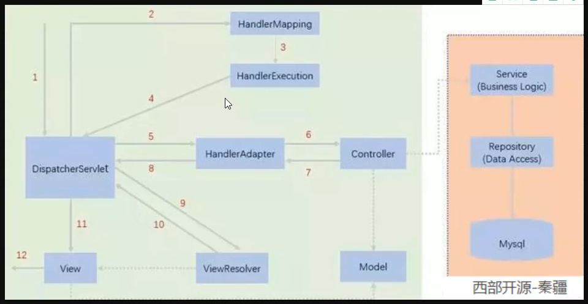
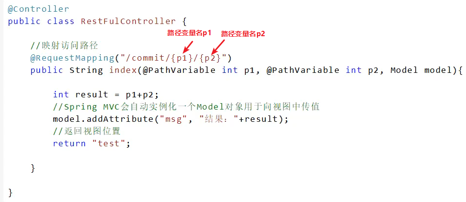

# 1 SpringMVC

> Spring Web MVC is the original web framework built on the Servlet API and has been included in the Spring Framework from the very beginning. The formal name, “Spring Web MVC,” comes from the name of its source module ([`spring-webmvc`](https://github.com/spring-projects/spring-framework/tree/master/spring-webmvc)), but it is more commonly known as “Spring MVC”.

## 1.1 MVC

- Model（模型）
  - 业务逻辑

- View（视图）
  - 展示数据

- Controller（控制器）
  - 连接Model和View

理解：用户请求由Controller接收，由Controller调用相应的Model（业务逻辑），Model返回数据后，Controller将数据交由View（前端展示页面）渲染，最后展现给用户；Controller也可直接返回一个静态页面不需要Model介入。

## 1.2 DispatcherServlet

> Spring MVC, as many other web frameworks, is designed around the front controller pattern where a central `Servlet`, the `DispatcherServlet`, provides a shared algorithm for request processing, while actual work is performed by configurable delegate components. This model is flexible and supports diverse workflows.

以DispatcherServlet为中心，DispatcherServlet提供一个共享的请求处理算法，真正的工作由注册的Bean来完成

> The `DispatcherServlet`, as any `Servlet`, needs to be declared and mapped according to the Servlet specification by using Java configuration or in `web.xml`. In turn, the `DispatcherServlet` uses Spring configuration to discover the delegate components it needs for request mapping, view resolution, exception handling, [and more](https://docs.spring.io/spring-framework/docs/current/reference/html/web.html#mvc-servlet-special-bean-types).

DispatcherServlet与其他Servlet一样需要根据Servlet规范在java代码中或着在web.xml文件中声明与映射，除此之外，DispatcherServlet还会使用Spring的配置文件来发现用来处理请求映射，视图解析，异常处理等等任务的Bean。

- 使用java注册并初始化DispatcherServlet

``` java
public class MyWebApplicationInitializer implements WebApplicationInitializer {

    @Override
    public void onStartup(ServletContext servletContext) {

        // Load Spring web application configuration
        AnnotationConfigWebApplicationContext context = new AnnotationConfigWebApplicationContext();
        context.register(AppConfig.class);

        // Create and register the DispatcherServlet
        DispatcherServlet servlet = new DispatcherServlet(context);
        ServletRegistration.Dynamic registration = servletContext.addServlet("app", servlet);
        registration.setLoadOnStartup(1);
        registration.addMapping("/app/*");
    }
}
```

- 使用web.xml来注册并初始化DispatcherServlet

``` xml
<web-app>

    <listener>
        <listener-class>org.springframework.web.context.ContextLoaderListener</listener-class>
    </listener>

    <context-param>
        <param-name>contextConfigLocation</param-name>
        <param-value>/WEB-INF/app-context.xml</param-value>
    </context-param>

    <servlet>
        <servlet-name>app</servlet-name>
        <servlet-class>org.springframework.web.servlet.DispatcherServlet</servlet-class>
        <init-param>
            <param-name>contextConfigLocation</param-name>
            <param-value></param-value>
        </init-param>
        <load-on-startup>1</load-on-startup>
    </servlet>

    <servlet-mapping>
        <servlet-name>app</servlet-name>
        <url-pattern>/app/*</url-pattern>
    </servlet-mapping>

</web-app>
```

### 1.2.1 Context Hierarchy





# 待整理

# 1 执行流程

请求由DispatcherServlet接收，DispatcherSerlvet在doDispatch方法中为当前请求选择合适的handler（通过handler mapping），再通过此handler找到合适的handler adapter（SimpleControllerHandlerAdapter和实现了Controller接口的handler适配），然后调用handler adapter的handle方法让handler处理请求


# 2 代码例子

1. 创建web项目

2. 在web.xml配置文件中注册DispatcherServlet并指定Spring配置文件，设置随Tomcat启动而启动; 映射路径设为"/".

   注意：如果映射路径为“/*”，当请求为“……/a.jsp”就会出错，因为它会去匹配jsp文件，而“/”不会匹配jsp文件。

   ``` xml
       <servlet>
           <servlet-name>DispatcherServlet</servlet-name>
           <servlet-class>org.springframework.web.servlet.DispatcherServlet</servlet-class>
           <!--指定DispatcherServlet要用的Spring配置文件-->
           <init-param>
               <param-name>contextConfigLocation</param-name>
               <param-value>classpath:springmvc-servlet.xml</param-value>
           </init-param>
           <load-on-startup>1</load-on-startup>
       </servlet>
       <!--
           不要用/*,它会匹配jsp页面,会造成错误
           用/,它不会匹配jsp页面
       -->
       <servlet-mapping>
           <servlet-name>DispatcherServlet</servlet-name>
           <url-pattern>/</url-pattern>
       </servlet-mapping>
   ```

3. 编写spring配置文件，注册适配器，映射器，视图解析器

   视图解析器中还要配置前后缀，注意要保证前缀所指位置由对应的文件或者文件夹，例子中的是“/WEB-INF/jsp/"

   注意：这里的映射器的映射方式是用BeanUrlHandlerMapping，Controller注册在spring配置文件中的ID要用‘’/‘’打头，不然找不到

   ``` xml
   <?xml version="1.0" encoding="UTF-8"?>
   <beans xmlns="http://www.springframework.org/schema/beans"
          xmlns:xsi="http://www.w3.org/2001/XMLSchema-instance"
          xsi:schemaLocation="http://www.springframework.org/schema/beans
           https://www.springframework.org/schema/beans/spring-beans.xsd">
   <!--    配置适配器-->
       <bean class="org.springframework.web.servlet.mvc.SimpleControllerHandlerAdapter"/>
   <!--    配置映射器-->
       <bean class="org.springframework.web.servlet.handler.BeanNameUrlHandlerMapping"/>
   <!--    配置视图解析器   后面接触模板引擎的时候会关联这里的知识点-->
       <bean id="internalResourceViewResolver" class="org.springframework.web.servlet.view.InternalResourceViewResolver">
           <property name="prefix" value="/WEB-INF/jsp/"/>
           <property name="suffix" value=".jsp"/>
       </bean>
   
   <!--    配置处理器-->
       <bean id="/hello" class="com.zcr.controller.HelloController"/>
   </beans>
   ```

4. 编写完Controller之后，将其注册到Spring配置文件中，如上所示的/hello

   ``` java
   public class HelloController implements Controller {
       @Override
       public ModelAndView handleRequest(HttpServletRequest request, HttpServletResponse response) throws Exception {
           ModelAndView modelAndView = new ModelAndView();
           modelAndView.addObject("msg","helloSpringMVC");
           modelAndView.addObject("title","test");
           modelAndView.setViewName("test");
           return modelAndView;
       }
   }
   ```

5. 启动tomcat测试。


# 3 使用注解开发的spring配置

``` xml
<?xml version="1.0" encoding="UTF-8"?>
<beans xmlns="http://www.springframework.org/schema/beans"
       xmlns:xsi="http://www.w3.org/2001/XMLSchema-instance"
       xmlns:context="http://www.springframework.org/schema/context"
       xmlns:mvc="http://www.springframework.org/schema/mvc"
       xsi:schemaLocation="http://www.springframework.org/schema/beans
        https://www.springframework.org/schema/beans/spring-beans.xsd
        http://www.springframework.org/schema/context
        https://www.springframework.org/schema/beans/spring-context.xsd
        http://www.springframework.org/schema/mvc
        https://www.springframework.org/schema/beans/spring-mvc.xsd">
<!--    扫描指定包，使指定包下的注解生效-->
    <context:component-scan base-package="com.zcr.controller"/>
<!--    由于我们用DispatcherServlet覆盖了web容器默认的serlvet，所以当请求一些静态文件时，DispatcherServlet就会接收到改请求，导致找不到合适的处理器，出现404错误，静态文件如CSS文件等，jsp文件有专门的JspServlet去处理所以不受影响。综上，为了能正常访问静态文件，所以要配置default-servlet-handler，此配置会将没有对应处理器的静态文件的请求送给web容器的defaultServlet去处理，使得能够正常访问静态文件-->
    <mvc:default-servlet-handler/>
<!--    使MVC支持使用注解开发-->
<!--    在spring中一般采用@RequestMapping来完成映射关系-->
<!--    要想@RequestMapping注解生效-->
<!--    必须在配置文件中注册DefaultAnnotationHandlerMapping和-->
<!--    AnnotationMethodHandlerAdapter这两个实例-->
<!--    这两个实例分别在类级别和方法级别处理.-->
<!--    而annotation-driven配置帮助我们自动完成上述两个实例的注入-->
    <mvc:annotation-driven/>

<!--    <bean class="org.springframework.web.servlet.handler.BeanNameUrlHandlerMapping"/>-->
<!--    <bean class="org.springframework.web.servlet.mvc.SimpleControllerHandlerAdapter"/>-->
    <bean class="org.springframework.web.servlet.view.InternalResourceViewResolver" id="internalResourceViewResolver">
        <property name="suffix" value=".jsp"/>
        <property name="prefix" value="/WEB-INF/jsp/"/>
    </bean>
</beans>
```

可以注意到，使用注解开发不需要手动注册适配器和映射器了，只需要注册一个视图解析器

使用到的注解：

- @Controller
  - 可使用在类上
  - 将类交由Spring容器管理
  
- @RequestMapping
  - 可指定映射路径和请求的方法，在指定映射路径和请求方法后和如下注解作用相同
    - @GetMapping
    - @PostMapping
    - @PutMapping
    - @DeleteMapping
  - 可以用在类和方法上
  
- @PathVariable

  - 在Restful风格的URL中获取URL上的参数

    ``` java
    @GetMapping("/owners/{ownerId}/pets/{petId}")
    public Pet findPet(@PathVariable Long ownerId, @PathVariable Long petId) {
        // ...
    }
    ```

  - 在获取URL参数的值之后，SpringMVC会将其自动转化为合适的类型。若与方法参数的类型不匹配就会产生TypeMismatchException

  - URL上的参数还可以用正则表达式 //TODO

  - URL上还可以嵌入${}占位符，用了占位符之后会调用PropertyPlaceHolderConfigurer来对外部属性资源文件进行解析，从而使用正确的值替代占位符

# 4 Restful API

传统的API：localhost:8080/XXX?arg1=1&arg2=2

Restful API: localhost:8080/XXX/[arg1]/[arg2]，其中的arg1和2用具体数字代替


在@RequestMapping中指定路径变量PathVariable，

然后在方法参数上使用@PathVariable去将真实的路径变量和参数绑定

方法参数的参数名不一定需要和真实的路径变量名相同，此时为了将两者绑定，可以在@PathVariable中手动指定需要与方法参数绑定的真实的路径变量的名字。




# 5 重定向和转发

重定向（改变URL）：

```java
@Controller
@RequestMapping("/beforeTest")
public class TestController {

    @RequestMapping("/test")
    public String test(){
        return "redirect:beforeHello/hello";
    }
}
```

此处return的字符串中，beforeHello前没有“ / ”，这是一个相对路径，例子：

当访问/beforeTest/test时，这个重定向会访问 /beforeTest/beforeHello/hello

若在beforeHello前加上“ / ”，这个“ / ”表示项目根目录，重定向会访问 /beforeHello/hello


转发（不改变URL）一样


# 6 过滤器Filter

Servlet版：

创建一个类EncodingFilter，实现Filter接口

```java
public class EncodingFilter implements Filter {
    @Override
    public void init(FilterConfig filterConfig) throws ServletException {

    }

    @Override
    public void doFilter(ServletRequest servletRequest, ServletResponse servletResponse, FilterChain filterChain) throws IOException, ServletException {
        servletRequest.setCharacterEncoding("utf-8");
        filterChain.doFilter(servletRequest, servletResponse);
    }

    @Override
    public void destroy() {

    }
}
```

然后在web.xml 中配置过滤器

```xml
<filter>
    <filter-name>EncodingFilter</filter-name>
    <filter-class>com.zcr.filter.EncodingFilter</filter-class>
</filter>
<filter-mapping>
    <filter-name>EncodingFilter</filter-name>
    <url-pattern>/*</url-pattern>
</filter-mapping>
```


SpringMVC版：

```xml
<filter>
    <filter-name>EncodingFilter</filter-name>
    <filter-class>org.springframework.web.filter.CharacterEncodingFilter</filter-class>
    <init-param>
        <param-name>encoding</param-name>
        <param-value>utf-8</param-value>
    </init-param>
</filter>
<filter-mapping>
    <filter-name>EncodingFilter</filter-name>
    <url-pattern>/*</url-pattern>
</filter-mapping>
```

SpringMVC内置了许多的过滤器


# 遇见的问题以及解决方案

1. 在编写数据库相关的属性文件的时候，如db.properties，加上jdbc前缀，以防和系统的相关变量重名，导致取错值

   > 在使用c3p0时，我在db.properties中有键值对（username, root）其中username和系统变量重名了，导致c3p0在取username的值时取到了我的电脑用户名106458而非root，最后导致连接数据库失败

